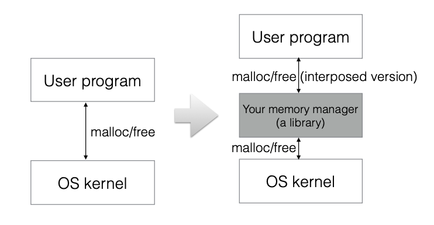
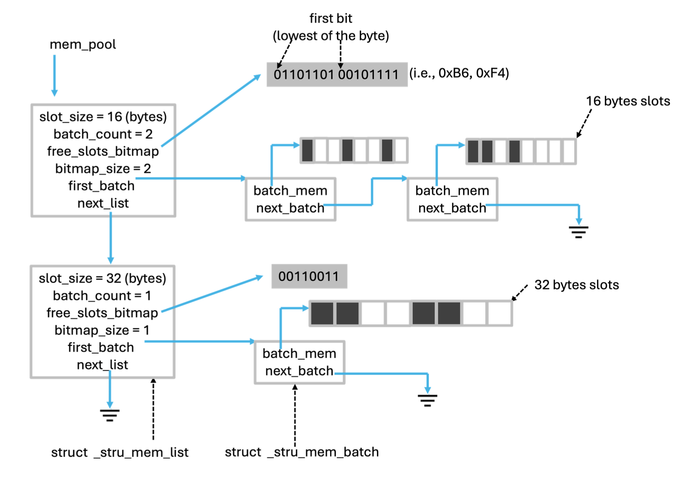

# Custom Memory Manager

## `Goal`
-   Benefit of implementing custom memory manager in C.  
-   The C memory allocation functions malloc and free bring performance overhead: these calls may lead to a switch between user-space and kernel-space. For programs that do frequent memory allocation/deallocation, using malloc/free will degrade the performance.  
-   A custom memory manager allows for detection of memory misuses, such as memory over- flow, memory leak and double deallocating a pointer.

**Figure 1:** Overview

## `Overview`
Figure 1: depicts where the memory manager locates in a system. The memory manager basically preallocates chunks of memory, and performs management on them based on the user program memory allocation/deallocation requests.
We use an example to illustrate how your memory manager is supposed to work. Suppose memory allocations in the memory manager are 16 bytes aligned.

-   After the user program starts, the first memory allocation from the program requests 12 bytes of memory (malloc(12)). Prior to this first request, your memory manager is initialized with a batch of memory slots, each of which has a size of 16 bytes. Memory manager returns the first slot of the batch to the user program.
-   Then the user program makes a second request (malloc(10)). Because the memory allocation is 16 bytes aligned, the memory manager should return a chunk of memory of 16 bytes. This time, because there are still available 16-byte-slots in the allocated batch, the memory manager simply return the second slot in the allocated batch to fulfill the request without interacting with the kernel.
-   The user program makes 6 subsequent memory requests, all of which are for memory less than 16 bytes. The memory manager simply returns each of the rest 6 free 16-byte-slots to fulfill the requests. And for the implementation of this project, assume you will only get requests for less than or equal to 16 bytes memory.
-   The user program makes the 9th request (malloc(7)). Because there is no free slots avail- able, the manager allocates another batch of memory slots of 16 bytes, and returns the first slot in this batch to the user program.
-   Suppose the 10th memory request from the user program is malloc(28). The manager should return a memory chunk of 32 bytes (remember memory allocation is 16 bytes aligned). Because there is no memory list of 32-byte-slots, the manager has to allocate a batch of memory slots of 32 bytes, and returns the first slot to fulfill this request. At this moment, the memory list of 32-byte-slots has only one memory batch.
-   The memory manager organizes memory batches that have the same slot size using linked list, and the resulting list is called a memory batch list, or a memory list.
-   Memory lists are also linked together using linked list. So the default memory list with slot size of 16 bytes is linked with the newly created 32 bytes slot size memory list.  

-   The manager uses a bitmap to track and manage slots allocation/deallocation for each memory batch list.
It is easy to see that with such a mechanism, the memory manager not only improves program performance by reducing the number of kernel/user space switches, but also tracks all the memory allocation/deallocation so that it can detect memory misuse such as double freeing. The memory manager can also add guard bytes at the end of each memory slot to detect memory overflow (just an example, adding guard bytes is not required by this project.)

**Figure 2:** Example Snapshot of Memory Manager Data Structure

Basically there are two kinds of linked list:  
-   A list of memory batches (with a certain slot size): as shown in the previous example, this list expands when there is no free slot available. The memory manager adds a new batch at the end of the list.
-   A list of memory batch list: this list expands when a new slot size comes in.

## `How the Code Works`
The code implements a custom memory manager that allocates and tracks memory in chunks to optimize performance and avoid fragmentation. Key components include:

`mem_mngr_init()`

Initializes the memory manager with a predefined slot size (aligned to 16 bytes) and creates the first memory batch.
A bitmap is used to mark slots as free or allocated.

`mem_mngr_alloc(size_t size)`
Allocates a memory slot based on the requested size.
If no suitable free slot is available, it creates a new batch and updates the bitmap.

`mem_mngr_free(void *ptr)`   
Frees a previously allocated memory slot.
The bitmap ensures that double frees are detected and flagged with an error.

`mem_mngr_print_snapshot()`  
Displays the current state of the memory manager, including slots and batches, for debugging.
mem_mngr_leave()

Frees all allocated memory and resets the manager to its initial state.

 
## `Test Cases`
### Working Test Cases:
#### Allocation:
Memory is successfully allocated for varying sizes, including small (1 byte) and larger chunks (up to 28 bytes).  

#### Deallocation:
All allocated memory is properly freed without errors.
Memory Snapshot:
The memory snapshot displays the current state of the memory list, batches, and bitmaps.

### Handled Errors:  
#### Double Free:
An attempt to free the same pointer twice results in an error message.
#### Invalid Pointer Free:
The manager correctly handles attempts to free a pointer not managed by it (e.g., 0xDEADBEEF).

## `Command`  
- Use `make` to build the project.
- Run with `make run` linked to libmemory_manager.a.
